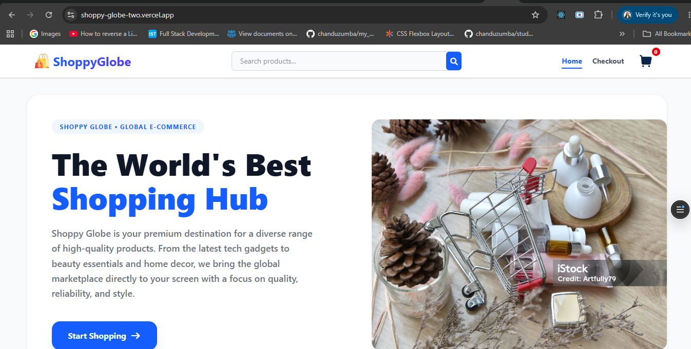
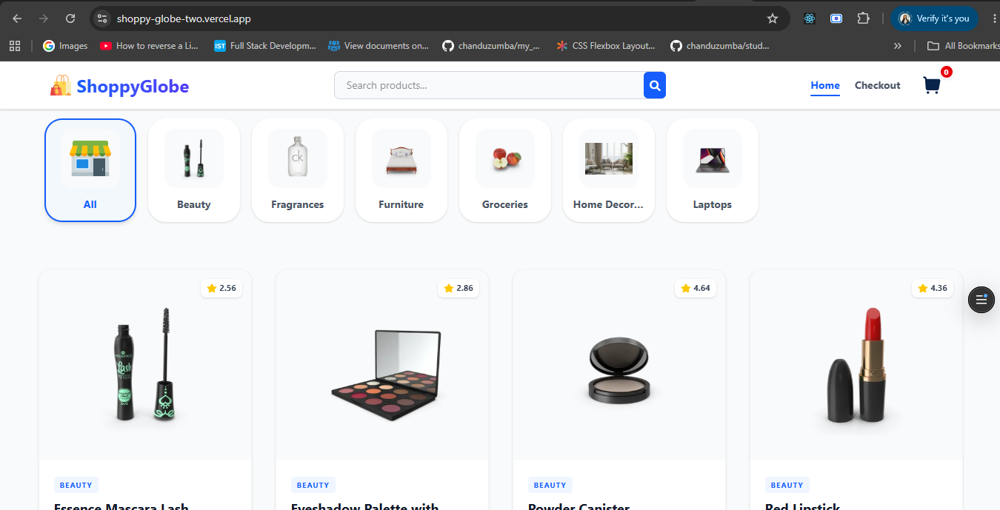
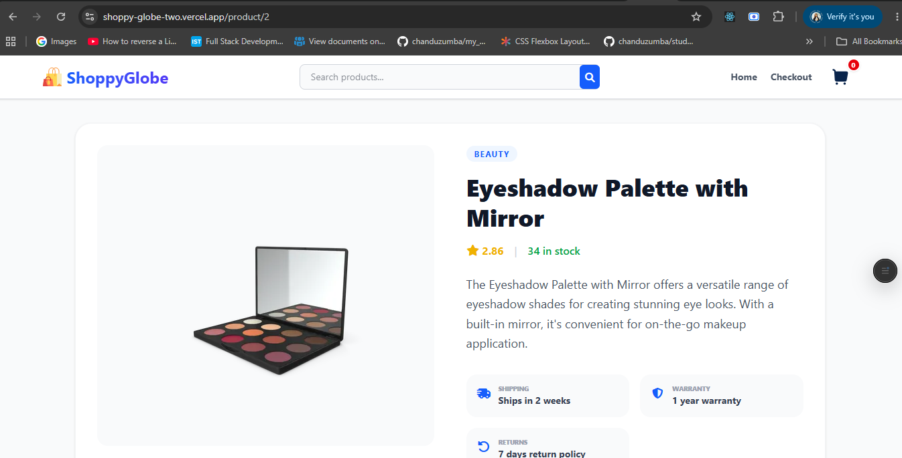
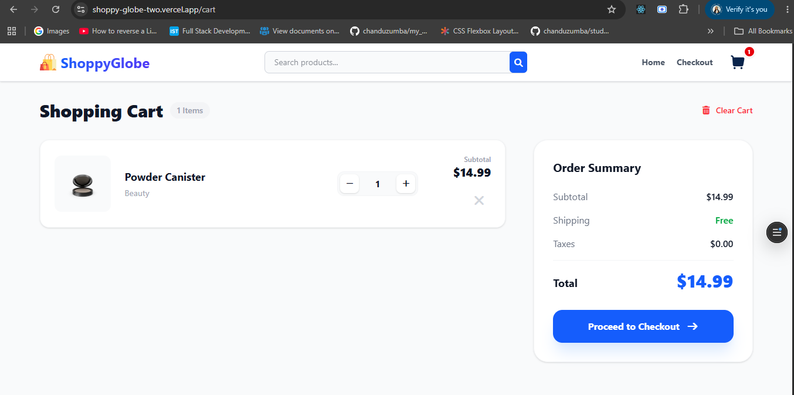
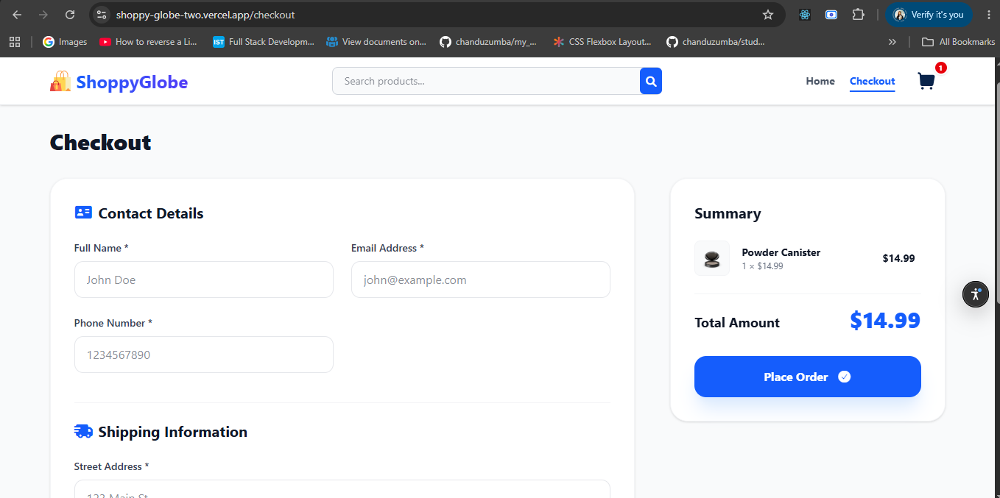

#  Shoppy Globe - E-Commerce Platform

Shoppy Globe is a modern, responsive e-commerce web application built to provide a premium shopping experience. Users can browse a wide variety of products, search for specific items, filter by categories, manage their shopping cart, and proceed through a validated checkout process.

##  Live Demo
https://shoppy-globe-two.vercel.app/

---

##  Tech Stack

- **Frontend:** React.js (Vite)
- **State Management:** Redux Toolkit
- **Routing:** React Router v7
- **Styling:** Tailwind CSS
- **Icons:** FontAwesome
- **Notifications:** React-Hot-Toast
- **API:** [DummyJSON API](https://dummyjson.com/)
- **Type Checking:** PropTypes

---

##  Key Features

###  Product Discovery
- **Dynamic Fetching:** Real-time data fetching from DummyJSON API with loading and error states.
- **Category Carousel:** Interactive horizontal scroll for category-based filtering (Beauty, Laptops, Furniture, etc.).
- **Global Search:** Instant search functionality to find products by name or category.
- **Detailed View:** Dedicated product pages featuring image galleries, customer reviews, shipping info, and warranty details.

###  Shopping Cart
- **Redux Integration:** Persistent state management for cart items, quantities, and totals.
- **Stock Validation:** Intelligent quantity controls that prevent users from exceeding available stock levels.
- **Subtotal Calculation:** Real-time price updates for individual items and the overall order summary.

###  Checkout & Validation
- **Structured Form:** Categorized sections for Contact Details and Shipping Information.
- **Robust Validation:**
  - Email format verification.
  - Phone number numeric check (10-15 digits).
  - Credit card number (16 digits) and CVV (3 digits) validation.
  - Expiry date logic ensuring cards are not expired.
- **Success Workflow:** Order confirmation modal with a summary and automatic redirection countdown to the Home page.

###  User Experience
- **Fully Responsive:** Optimized layouts for mobile, tablet, and desktop devices.
- **Visual Feedback:** Custom toast notifications for cart actions (Add/Remove/Update).
- **Smooth Navigation:** Support for smooth-scrolling and active-link highlighting.

### Performance Optimizations
- **Code Splitting:** Implemented React.lazy and Suspense for route-based code splitting, reducing initial bundle size and improving load times.
- **Image Optimization:** Utilizes `loading="lazy"` and `decoding="async"` attributes on images for efficient loading and improved page responsiveness.
- **Memoization:** Employs `useMemo` and `useCallback` hooks in complex components (e.g., Checkout form validation) to prevent unnecessary re-renders and optimize performance.
- **Initial Mount Skip:** Custom logic using `useRef` to prevent unwanted auto-scrolling on the initial component mount, enhancing user experience.


---

##  Project Structure

```text
shoppy-globe/
├── src/
│   ├── assets/             # SVGs and static images
│   ├── components/         # Reusable UI components
│   │   ├── Header.jsx      # Navigation, Search & Brand
│   │   ├── ProductItem.jsx # Shared Product Card
│   │   ├── CartItem.jsx    # Item layout within the cart
│   │   └── ...             # Carousel, ProductList, etc.
│   ├── hooks/              # Custom hooks (e.g., useFetch)
│   ├── pages/              # Main view components
│   │   ├── Home.jsx        # Landing page with Hero & Categories
│   │   ├── Cart.jsx        # Cart management view
│   │   ├── Checkout.jsx    # Form validation & Order placement
│   │   └── ProductDetails.jsx # Detailed product information
│   ├── redux/              # Store configuration and Slices
│   ├── App.jsx             # Root router configuration
│   └── main.jsx            # Application entry point
├── tailwind.config.js      # Styling configuration
└── package.json            # Project dependencies
```

---

##  Installation & Setup

1. **Clone the repository:**
   ```bash
   git clone https://github.com/chanduzumba/shoppy-globe.git
   ```
2. **Navigate to the directory:**
   ```bash
   cd shoppy-globe
   ```
3. **Install dependencies:**
   ```bash
   npm install
   ```
4. **Start the development server:**
   ```bash
   npm run dev
   ```

---

## 📸 Screenshots

###  Home Page


###  Product List


###  Product Details


###  Shopping Cart


###  Checkout Page


---

## 🔗 Connect with Me
- **GitHub:** https://github.com/chanduzumba
- **LinkedIn:** https://www.linkedin.com/in/chandrika-prakash-06723a266/